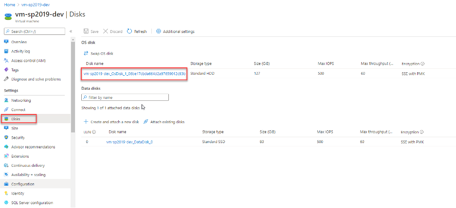
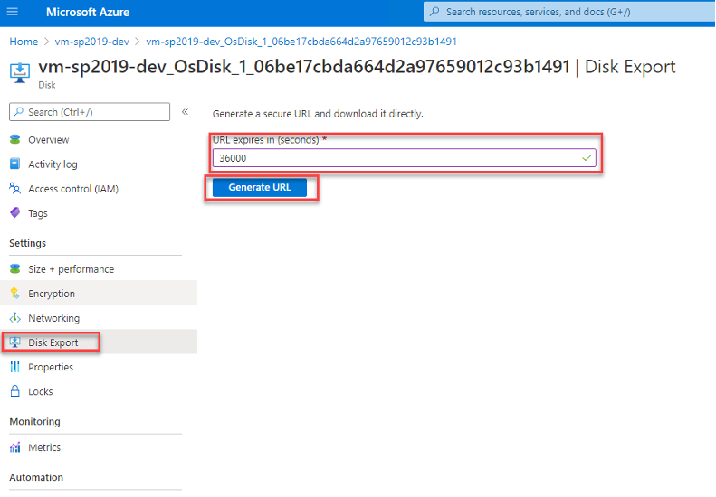
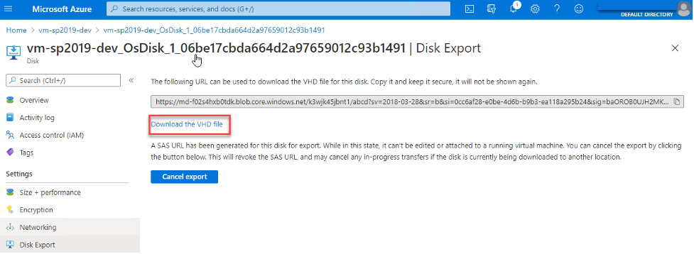
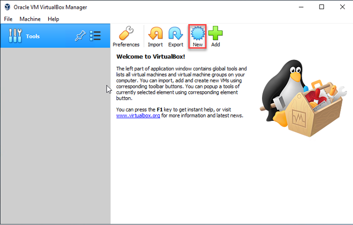
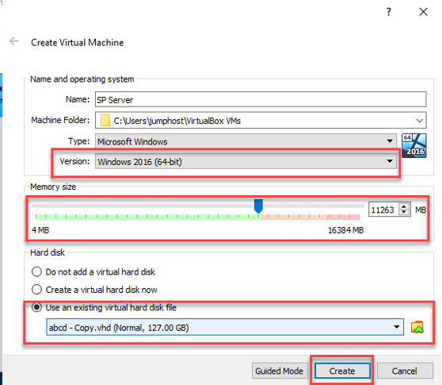
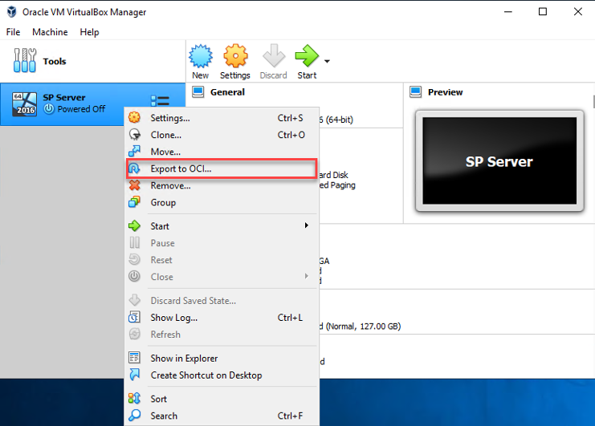
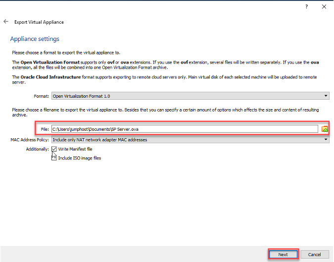
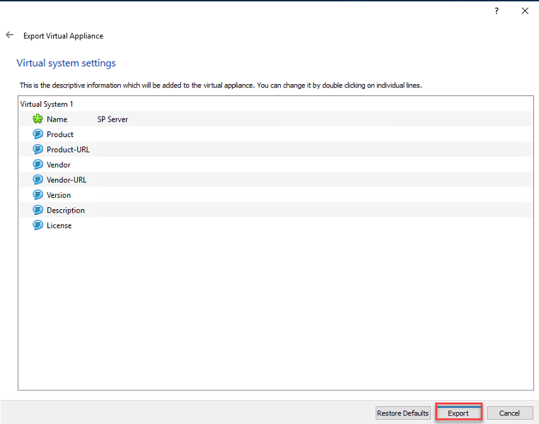
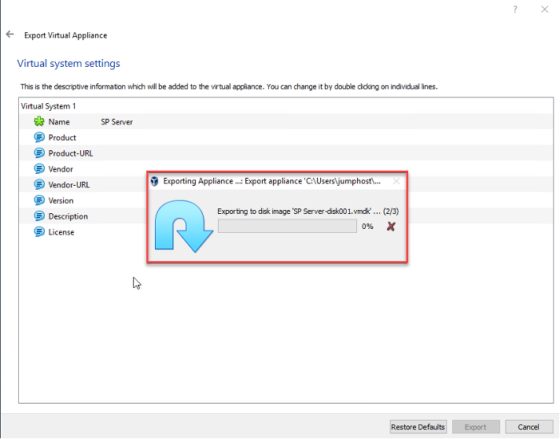

## Version: Sharepoint 2019
## Topology: Single Server Farm
## Target: OVA

# Steps

## Pre-Requisites
VM running Sharepoint 2019 on Azure (VHD)
[Follow these steps](./sp-vm-manual-install)

## Download Source VHD file

Log in into your Azure subscription to download the VHD file of SharePoint Server. To download the VHD file we followed below steps.

1. Logged In to the Azure Portal, navigated to the specific virtual machine for which we need to download VHD file.
2. Selected ‘Disks’ on the management portal and selected the ‘OS disk’ that needed to be exported.

3. Once the disk has been selected, it navigated to the configuration of the Disk.
4. On the configuration of the Disk, selected ‘Disk Export’. Extended the ‘URL Expires’ and clicked on ‘Generate URL’.

5. After clicking on ‘Generate URL’ an url to download will get appear as well as you will able to see ‘Download the VHD file’. 
6. Click on ‘Download the VHD file’ to download VHD, it might takes hours depending upon the size of file.

## Convert VHD to OVA

Once VHD file is completely downloaded on your Machine, the next process is to convert it into OVA. To convert it into OVA, we require ‘Oracle VM VirtualBox Manager’. You can download Virutal Box from this link . For the Process of Installing Virutal BOX you can visit to Annex-1 (Installation of Oracle VM Virtual BOX) . After Installing Virtual Box, follow below steps to convert VHD into OVA.

### Import VHD and Create Virtual Machine

First of all you need to import the VHD file which has been downloaded from Azure Machine to create a Virtual machine. To import virtual machine follow below steps.

1. Open Virtual Box and click on ‘New’.

2. Provided the specification to the Virtual machine as of below. Located VM file which was downloaded and clicked on ‘Create’

### Exporting to OVA

After Creation of VM, it has been tested for the smooth operation. Once the testing has been completed, followed below steps to export it into OVA file.

1. Right clicked on VM and selected ‘Export to OCI…’

2. Specified the location to export OVA file and clicked on ‘Next’

3. Validated for the Virtual Application configuration and clicked on ‘Export’.

4. It took around 1-2 hours to complete the export. Duration depends upon the size of file.
